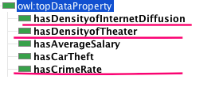
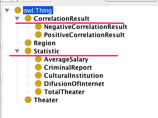

## Report: Implementation of suggested changes

This paper presents the changes that were have been made to the CRAWCI Project https://github.com/simayguzel/OpenDataCRAWCI/blob/master/CRAWCI%20Documentation.md to improve the quality of published datasets.

### Privacy violation 

This part describes the detected privacy issue regarding the dataset **D2**  (I.Stat, Delitti denunciati dalle forze di polizia all'autorità giudiziaria, viewed 14 November 2019, http://dati.istat.it/Index.aspx?DataSetCode=DCCV_DELITTIPS ). The datasets provide information on crimes reported by the police to the judicial authority.

Even though the dataset is anonymized there is a risk of identification if other attributes about an individual are released. The latter can be resulted from cross-referencing and connecting different datasets. Considering the fact that in our case some types of crimes feature very small values (ex. 3, 7), the risk of being identified even increases.  What is more, despite the anonymization techniques, data can be reidentified by using machine learning. 

For this reason, when releasing data on the Web it is of crucial importance to ensure that the risk of a privacy violation is as low as possible unless there was some other reason why privacy was not a priority (for example, there may be a public interest in the publication of some personal information,
such as the identities of suspected criminals) (Analytical Report 3: Open Data and Privacy) https://www.europeandataportal.eu/sites/default/files/open_data_and_privacy_v1_final_clean.pdf. 

Hence, it is necessary to distinguish between open data and public data which bears risks for personally identifiable information to be disclosed while achieving a particular policy. The dataset published by I.Stat presents a risk of privacy violation. Consequently, a possible solution could be not publishing the data that presents too small values and as a result, bears risks of being identified. If the data is to be published, there are two paramount aspects to consider. Firstly, evaluate the final goal and do not produce open data that could result in privacy violations. Secondly, include the impact assessment to analyze the likelihood of privacy violations.


### Data Normalization

The normalization of data was done in order to adjust values measured on different scales to a notionally common scale.

A **crime rate** was calculated by dividing the number of reported crimes by the total population of the region, of 2016 respectively; the result was multiplied by 100,000 which means the distribution of crime reports per 100, 000 population. The **types of crime** were calculated following the same scheme.

The total number of theatres was presented in our data as **the distribution of theatres** divided by the total population of the region, of 2016 respectively. 

The results in % are presented in the visualization part on the website with the accompanying explanations.

Updated csv documents can be found in dataset/rdf folder here: 
https://github.com/simayguzel/OpenDataCRAWCI/blob/master/dataset-rdf/crawciopendata.csv

https://github.com/simayguzel/OpenDataCRAWCI/blob/master/dataset-rdf/typesofcrimes.csv

### The Ontology
As seen below, the changes we have made are underlined. The names of classes and some data properties of our ontology have been changed.




The updated ontology can be found here:

### RDF 

Our .rdf has been updated with namespaces from **Geonames Ontology** (http://www.geonames.org/ontology#) in order to sufficiently describe the regions without bearing the risk of referencing primarily those resources that are not reliable enough. 
As a result, we referenced Geonames links to the regions, (ex. Veneto: http://sws.geonames.org/3164604). Moreover, we used the following namespaces:

- <gn:alternateName>
- <gn:countryCode>
- <gn:locationMap>
- <gn:population>

The rdf example for Veneto region is presented below:

```
  <rdf:Description rdf:about="http://sws.geonames.org/3164604/">
      <rdfs:seeAlso "http://dbpedia.org/resource/Veneto">
      <gn:alternateName "Regione del Veneto" , "Veneto" , "Venetia">
      <gn:countryCode "IT">
      <gn:locationMap "http://www.geonames.org/3164604/regione-veneto.html">
      <gn:population>"1234079"</gn:population>
      <ds:average_salary>30332</ds:average_salary>
      <cis:hostsCulturalEvent>21</cis:hostsCulturalEvent>
      <ds:total_crime_rate>47465</dcterms:crimerate>
      <ds:internet_diffusion>72,4</ds:internet_diffusion>
  </rdf:Description>
  ```

  The updated .rdf can be found here https://github.com/simayguzel/OpenDataCRAWCI/blob/master/dataset-rdf/dataset.rdf

  The updated .rdf of types of crimes dataset can be found here:https://github.com/simayguzel/OpenDataCRAWCI/blob/master/dataset-rdf/crimedataset.rdf

### Correlation

1.Correlation between average salary and density of cultural institution

The first numbers in brackets are average salary, the second numbers in brackets are the density of cultural institutions per region in Italy.

```
(34290,0.0246) (33504,0) (35866,0.0511) (40459,0.0238) (396740,0) (30332,0.0131) (37483,0.0261) (40187,0.0265) (38202,0.0341) (35860,0.0315) (36687,0.0413) (36636,0.0312) (31712,0.0224) (28581,0.0132 (27778,0.0263) (31726,0.0129) (28578,0.0083) (26852,0.0132) (25936,0.0121) (30332,0.0125)
```

Correlation result: -0.20283

2.Correlation between average salary and internet diffusion

The first numbers in brackets are average salary, the second numbers in brackets are internet diffusion per region in Italy.

```
(34290,69.1) (33504,69.4) (35866,65.2) (40459,73.7) (396740,72.5) (30332,72.6) (37483,73.1) (40187,71.9) (38202,71.9) (35860,69) (36687,70) (36636,72.9) (31712,70) (28581,63.2) (27778,64.4) (31726,62.4) (28578,62.7) (26852,59.4) (25936,60.6) (30332,72.4)

```

Correlation result: 0.34735


3.Correlation between average salary and crime rate

The first numbers in bracket are average salary, the second numbers in brackets are crime rate per region in Italy.

```
(34290,207885) (33504,4085) (35866,79898) (40459,475194) (396740,16323) (30332,169999) (37483,35552) (40187,229630) (38202,176246) (35860,30108) (36687,47067) (36636,276255) (31712,43136) (28581,8205) (27778,222685) (31726,149334) (28578,13570) (26852,61137) (25936,176318) (30332,47465)

```

Correlation result: -0.27468

4.Correlation between average salary and theater density

The first numbers in brackets are average salary, the second numbers in brackets are theater density per region in Italy.

```
(34290,0.00468035315392) (33504,0.000696045590986) (35866,0.002902574457345) (40459,0.00655756731662) (396740,0.002074688796681) (39521,0.00023629489603) (37483,0.001974983541804) (40187,0.004401524109841) (38202,0.000827195021074) (35860,0.003160370424813) (36687,0.005723781388479) (36636,0.001870574088095) (31712,0.00064623338257) (28581,0.00004190412) (27778,0.002084781097985) (31726,0.00627661959202) (28578,0.001839926402944) (26852,0.001381710250243) (25936,0.0062766195021074) (30332,0.00468035315392)

```

Correlation result: -0.13636

5.Correlation between internet diffusion and density of cultural institution:

The first numbers in brackets are internet diffusion, the second numbers in brackets are the density of cultural institutions per region in Italy.

```
(69.1,0.0246) (69.4,0) (65.2,0.0511) (73.7,0.0238) (72.5,0) (72.6,0.0131) (73.1,0.0261) (71.9,0.0265) (71.9,0.0341) (69,0.0315) (70,0.0413) (72.9,0.0312) (70,0.0224) (63.2,0.0132)(64.4,0.0263) (62.4,0.0129) (62.7,0.0083) (59.4,0.0132) (60.6,0.0121) (72.4,0.0125)

```

Correlation result: 0.17454

6.Correlation between internet diffusion and crime rate:

The first numbers in brackets are internet diffusion, the second numbers in brackets are crime rate per region in Italy.

```
(207885,69.1) (69.4,4085) (65.2,79898) (73.7,475194) (72.5,16323) (72.6,169999) (73.1,35552) (71.9,229630) (71.9,176246) (69,30108) (70,47067) (72.9,276255) (70,43136) (63.2,8205) (64.4,222685) (62.4,149334) (62.7,13570) (59.4,61137) (60.6,176318) (72.4,47465)


```

Correlation result: -0.23655

7.Correlation between internet diffusion and theater density:

The first numbers in brackets are internet diffusion, the second numbers in brackets are theater density per region in Italy.

```
(69.1,0.00468035315392) (69.4,0.000696045590986) (65.2,0.002902574457345) (73.7,0.00655756731662) (72.5,0.002074688796681) (72.6,0.00023629489603) (73.1,0.001974983541804) (71.9,0.004401524109841) (71.9,0.000827195021074) (69,0.003160370424813) (70,0.005723781388479) (72.9,0.001870574088095) (70,0.00064623338257) (63.2,0.00004190412) (64.4,0.002084781097985) (62.4,0.00627661959202) (62.7,0.001839926402944) (59.4,0.001381710250243) (60.6,0.0062766195021074) (72.4,0.00468035315392)

```

Correlation result:-0.03994

8.Correlation between crime rate and theater density:

The first numbers in brackets are crime rate, the second numbers in brackets are theater density per region in Italy.

```
(207885,0.00468035315392) (4085,0.000696045590986) (79898,0.002902574457345) (475194,0.00655756731662) (16323,0.002074688796681) (169999,0.00023629489603) (35552,0.001974983541804) (229630,0.004401524109841) (176246,0.000827195021074) (30108,0.003160370424813) (47067,0.005723781388479) (276255,0.001870574088095) (43136,0.00064623338257) (8205,0.00004190412) (222685,0.002084781097985) (149334,0.00627661959202) (13570,0.001839926402944) (61137,0.001381710250243) (176318,0.0062766195021074) (47465,0.00468035315392)

```

Correlation result: 0.43844

Correlation between crime rate and density of cultural institution:

The first numbers in brackets are crime rate, the second numbers in brackets are the density of cultural institutions per region in Italy.

```
(207885,0.0246) (4085,0) (79898,0.0511) (475194,0.0238) (16323,0) (169999,0.0131) (35552,0.0261) (229630,0.0265) (176246,0.0341) (30108,0.0315) (47067,0.0413) (276255,0.0312) (43136,0.0224) (8205,0.0132) (222685,0.0263) (149334,0.0129) (13570,0.0083) (61137,0.00132) (176318,0.0121) (47465,0.0125)

```

Correlation result:  0.25884

Correlation between the density of cultural institution and theater density:

The first numbers in brackets are the density of cultural institution, the second numbers in brackets are theater density per region in Italy.

```
(0.0246,0.00468035315392) (0,0.000696045590986) (0.0511,0.002902574457345) (0.0238,0.00655756731662) (0,0.002074688796681) (0.0131,0.00023629489603) (0.0261,0.001974983541804) (0.0265,0.004401524109841) (0.0341,0.000827195021074) (0.0315,0.003160370424813) (0.0413,0.005723781388479) (0.0312,0.001870574088095) (0.0224,0.00064623338257) (0.0132,0.00004190412) (0.0263,0.002084781097985) (0.0129,0.00627661959202) (0.0083,0.001839926402944) (0.0132,0.001381710250243) (0.0121,0.0062766195021074) (0.0125,0.00468035315392)


```

Correlation result: 0.17623

As it is seen the average salary doesn't affect the density of cultural institutions, crime rate, and theater density while the internet diffusion increases with the increase of average salary per region. There is a positive correlation between internet diffusion and cultural institution density but there is a negative correlation between internet diffusion and crime rate. Additionally, there is a low negative correlation between internet diffusion and theater density. We can deduce that the crime rate increases the theater density more than that of a cultural institution. 


### Technical issue / User Experience
